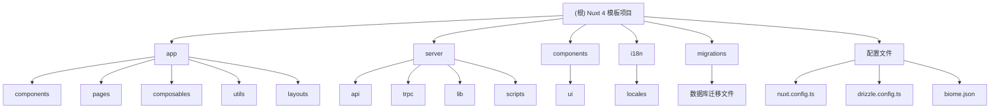

# CLAUDE.md - Nuxt 4 模板项目

## 项目愿景

这是一个现代化的 Nuxt 4 全栈应用模板，集成了当前最佳的技术栈和开发实践。项目旨在为快速启动新项目提供坚实的基础，包含完整的前端 UI、后端 API、数据库集成、国际化支持和自动化部署流程。

## 架构总览

### 技术栈
- **前端框架**: Nuxt 4 + Vue 3 + TypeScript
- **UI 组件**: Tailwind CSS V4 + shadcn-vue + 深色模式
- **状态管理**: Pinia
- **类型安全 API**: tRPC + Zod
- **数据库**: Drizzle ORM + Cloudflare D1 (生产) + SQLite (开发)
- **国际化**: @nuxtjs/i18n (中英双语)
- **工具库**: VueUse + date-fns + radash
- **代码质量**: Biome (格式化 + 检查)
- **部署**: Cloudflare Pages + GitHub Actions

### 架构特点
- **全栈 TypeScript**: 从前端到后端的完整类型安全
- **SSR/SSG 支持**: 服务端渲染和静态生成灵活切换
- **响应式设计**: 移动端优先的自适应布局
- **模块化结构**: 清晰的代码组织和分层架构
- **开发体验**: 热重载、自动导入、类型提示

## ✨ 模块结构图

```mermaid
graph TD
    A["(根) Nuxt 4 模板项目"] --> B["app"]
    A --> C["server"]
    A --> D["components"]
    A --> E["i18n"]
    A --> F["migrations"]
    A --> G["配置文件"]

    B --> B1["components"];
    B --> B2["pages"];
    B --> B3["composables"];
    B --> B4["utils"];
    B --> B5["layouts"];

    C --> C1["api"];
    C --> C2["trpc"];
    C --> C3["lib"];
    C --> C4["scripts"];

    D --> D1["ui"];

    E --> E1["locales"];

    F --> F1["数据库迁移文件"];

    G --> G1["nuxt.config.ts"];
    G --> G2["drizzle.config.ts"];
    G --> G3["biome.json"];

    click B "./app/CLAUDE.md" "查看 app 模块文档"
    click C "./server/CLAUDE.md" "查看 server 模块文档"
    click D "./components/CLAUDE.md" "查看 components 模块文档"
    click E "./i18n/CLAUDE.md" "查看 i18n 模块文档"
    click F "./migrations/CLAUDE.md" "查看 migrations 模块文档"
```

## 模块索引

| 模块路径 | 类型 | 职责描述 | 主要文件 |
|---------|------|----------|----------|
| `app/` | 前端应用 | Nuxt 4 核心应用目录，包含页面、组件、组合式函数 | `app.vue`, `pages/`, `components/`, `composables/` |
| `server/` | 后端服务 | 服务端 API、tRPC 路由、数据库操作 | `api/`, `trpc/`, `lib/db.ts`, `lib/schema.ts` |
| `components/` | UI 组件 | 全局 shadcn-vue 组件库 | `ui/`, `button/`, `card/`, `input/` |
| `i18n/` | 国际化 | 中英文双语支持配置 | `locales/zh.json`, `locales/en.json` |
| `migrations/` | 数据库 | Drizzle ORM 迁移文件 | `.sql` 文件, `meta/` |
| `配置文件` | 项目配置 | 各种构建和开发工具配置 | `nuxt.config.ts`, `drizzle.config.ts`, `biome.json` |

## 编码规范

### 代码风格
- 使用 Biome 进行代码格式化和检查
- 2 空格缩进，100 字符行宽
- 双引号字符串，尾随逗号
- 自动导入：`app/` 目录内的组件、composables、utils

### 命名约定
- **组件**: PascalCase (如 `DemoCounter.vue`)
- **Composables**: use 开头 (如 `useTRPC.ts`)
- **工具函数**: camelCase (如 `formatRelativeTime`)
- **文件名**: kebab-case 或 camelCase

### 目录组织原则
- **应用特定代码** → `app/` 目录
- **全局可复用代码** → 根目录对应目录
- **第三方库封装** → `lib/` 目录
- **静态资源** → `public/` 或 `app/assets/`

## AI 使用指引

### 项目结构理解
- 这是一个 Nuxt 4 全栈应用，采用新的 `app/` 目录结构
- 前后端完全 TypeScript，通过 tRPC 实现类型安全通信
- 数据库支持本地 SQLite 和生产环境 Cloudflare D1
- 组件分为应用级 (`app/components/`) 和全局级 (`components/`)

### 开发建议
1. **新增页面**: 在 `app/pages/` 创建 `.vue` 文件，路由自动生成
2. **新增组件**: 根据作用域选择 `app/components/` 或 `components/`
3. **API 开发**: 在 `server/trpc/router.ts` 定义路由，在 `server/trpc/routes/` 实现
4. **数据库操作**: 使用 Drizzle ORM，修改 `server/lib/schema.ts` 后运行迁移
5. **样式开发**: 使用 Tailwind CSS 类名，参考 shadcn-vue 组件实现

### 注意事项
- `app/` 目录内的文件支持自动导入
- tRPC 提供前后端类型安全的 API 通信
- 数据库配置支持开发环境和生产环境自动切换
- 所有 UI 组件都支持深色模式
- 国际化文件需要同时更新中英文版本

## 相关链接

- [项目 README](./README.md)
- [部署指南](./DEPLOYMENT.md)
- [项目结构说明](./PROJECT_STRUCTURE.md)
- [Drizzle 配置说明](./DRIZZLE_SETUP.md)
- [Nuxt 4 官方文档](https://nuxt.com/)
- [shadcn-vue 组件库](https://www.shadcn-vue.com/)
- [tRPC 文档](https://trpc.io/)