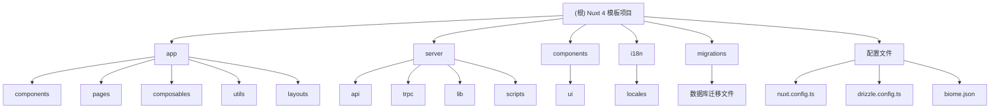

# CLAUDE.md - Nuxt 4 模板项目

## 项目愿景

这是一个现代化的 Nuxt 4 全栈应用模板，集成了当前最佳的技术栈和开发实践。项目旨在为快速启动新项目提供坚实的基础，包含完整的前端 UI、后端 API、数据库集成、国际化支持和自动化部署流程。

## 架构总览

### 技术栈

- **前端框架**: Nuxt 4 + Vue 3 + TypeScript
- **UI 组件**: Tailwind CSS V4 + shadcn-vue + 深色模式
- **状态管理**: Pinia
- **类型安全 API**: tRPC + Zod
- **数据库**: Drizzle ORM + Cloudflare D1 (生产) + SQLite (开发)
- **国际化**: @nuxtjs/i18n (中英双语)
- **工具库**: date-fns + radash + VueUse (SSR 兼容版本)
- **代码质量**: ESLint + Prettier (格式化 + 检查)
- **部署**: Cloudflare Pages + GitHub Actions

### 架构特点

- **全栈 TypeScript**: 从前端到后端的完整类型安全
- **SSR/SSG 支持**: 服务端渲染和静态生成灵活切换
- **响应式设计**: 移动端优先的自适应布局
- **模块化结构**: 清晰的代码组织和分层架构
- **开发体验**: 热重载、自动导入、类型提示

## ✨ 模块结构图

```mermaid
graph TD
    A["(根) Nuxt 4 模板项目"] --> B["app"]
    A --> C["server"]
    A --> D["components"]
    A --> E["i18n"]
    A --> F["migrations"]
    A --> G["配置文件"]

    B --> B1["components"];
    B --> B2["pages"];
    B --> B3["composables"];
    B --> B4["utils"];
    B --> B5["layouts"];

    C --> C1["api"];
    C --> C2["trpc"];
    C --> C3["lib"];
    C --> C4["scripts"];

    D --> D1["ui"];

    E --> E1["locales"];

    F --> F1["数据库迁移文件"];

    G --> G1["nuxt.config.ts"];
    G --> G2["drizzle.config.ts"];
    G --> G3["biome.json"];

    click B "./app/CLAUDE.md" "查看 app 模块文档"
    click C "./server/CLAUDE.md" "查看 server 模块文档"
    click D "./components/CLAUDE.md" "查看 components 模块文档"
    click E "./i18n/CLAUDE.md" "查看 i18n 模块文档"
    click F "./migrations/CLAUDE.md" "查看 migrations 模块文档"
```

## 模块索引

| 模块路径      | 类型     | 职责描述                                        | 主要文件                                            |
| ------------- | -------- | ----------------------------------------------- | --------------------------------------------------- |
| `app/`        | 前端应用 | Nuxt 4 核心应用目录，包含页面、组件、组合式函数 | `app.vue`, `pages/`, `components/`, `composables/`  |
| `server/`     | 后端服务 | 服务端 API、tRPC 路由、数据库操作               | `api/`, `trpc/`, `lib/db.ts`, `lib/schema.ts`       |
| `components/` | UI 组件  | 全局 shadcn-vue 组件库                          | `ui/`, `button/`, `card/`, `input/`                 |
| `i18n/`       | 国际化   | 中英文双语支持配置                              | `locales/zh.json`, `locales/en.json`                |
| `migrations/` | 数据库   | Drizzle ORM 迁移文件                            | `.sql` 文件, `meta/`                                |
| `配置文件`    | 项目配置 | 各种构建和开发工具配置                          | `nuxt.config.ts`, `drizzle.config.ts`, `biome.json` |

## 编码规范

### 代码风格

- 使用 Biome 进行代码格式化和检查
- 2 空格缩进，100 字符行宽
- 双引号字符串，尾随逗号
- 自动导入：`app/` 目录内的组件、composables、utils

### 命名约定

- **组件**: PascalCase (如 `DemoCounter.vue`)
- **Composables**: use 开头 (如 `useTRPC.ts`)
- **工具函数**: camelCase (如 `formatRelativeTime`)
- **文件名**: kebab-case 或 camelCase

### 目录组织原则

- **应用特定代码** → `app/` 目录
- **全局可复用代码** → 根目录对应目录
- **第三方库封装** → `lib/` 目录
- **静态资源** → `public/` 或 `app/assets/`

## AI 使用指引

### 项目结构理解

- 这是一个 Nuxt 4 全栈应用，采用新的 `app/` 目录结构
- 前后端完全 TypeScript，通过 tRPC 实现类型安全通信
- 数据库支持本地 SQLite 和生产环境 Cloudflare D1
- 组件分为应用级 (`app/components/`) 和全局级 (`components/`)

### 开发建议

1. **新增页面**: 在 `app/pages/` 创建 `.vue` 文件，路由自动生成
2. **新增组件**: 根据作用域选择 `app/components/` 或 `components/`
3. **API 开发**: 在 `server/trpc/router.ts` 定义路由，在 `server/trpc/routes/` 实现
4. **数据库操作**: 使用 Drizzle ORM，修改 `server/lib/schema.ts` 后运行迁移
5. **样式开发**: 使用 Tailwind CSS 类名，参考 shadcn-vue 组件实现

### 注意事项

- `app/` 目录内的文件支持自动导入
- tRPC 提供前后端类型安全的 API 通信
- 数据库配置支持开发环境和生产环境自动切换
- 所有 UI 组件都支持深色模式
- 国际化文件需要同时更新中英文版本
- **重要**: 项目通过兼容性适配层确保 VueUse 的 SSR 兼容性

## ⚠️ 关键修复记录

### VueUse SSR 兼容性方案

**问题背景：**
项目在使用 VueUse 库时遇到 Cloudflare Pages SSR 环境兼容性问题，主要表现为构建失败和运行时错误。

**根本原因：**
VueUse 库大量依赖浏览器原生 API（如 `window`, `document`, `navigator`），这些 API 在 Cloudflare Pages 的服务端渲染环境中不可用，导致：

- 构建时出现 `window is not defined` 错误
- SSR 渲染失败
- 部署后应用无法正常运行

**解决方案：**

1. **保留 VueUse 核心依赖**
   - 保留项目中可安全使用的 VueUse 函数
   - 维持原有 API 接口不变

2. **创建兼容性适配层**
   创建 `app/utils/vueuse.ts` 文件，提供 SSR 兼容的实现：
   - `useMediaQuery`: 使用 `window.matchMedia` 原生 API + 客户端检查
   - `useMouse`: 使用原生事件监听器 + 环境隔离
   - `useWindowSize`: 使用 `window.addEventListener` + SSR 安全
   - `useToggle`: 使用 Vue 3 的 `ref` 实现状态管理
   - `useDark`: 读取本地存储和系统偏好
   - `useClipboard`: 使用现代剪贴板 API

3. **客户端安全检查**
   - 所有涉及 DOM API 的操作都增加了 `process.client` 环境检查
   - 使用 `onMounted` 钩子确保组件挂载后再执行 DOM 操作
   - 添加了完善的错误边界处理，避免服务端渲染错误

**关键文件：**

- `app/utils/vueuse.ts` - VueUse 功能的兼容性替代实现
- `app/components/demo/UtilityTest.vue` - 工具函数测试和演示
- `eslint.config.js` - ESLint 配置，忽略 UI 组件库文件

**方案效果：**

- ✅ 构建成功，消除所有 SSR 相关错误
- ✅ 功能完整，保持原有 VueUse API 特性
- ✅ 环境隔离，客户端和服务端都能正常运行
- ✅ 部署成功，在 Cloudflare Pages 正常运行

**经验总结：**

1. **环境隔离**: SSR 项目必须严格区分客户端和服务端环境
2. **渐进增强**: 先确保基础功能可用，再添加客户端增强特性
3. **兼容性优先**: 选择 SSR 友好的实现方式，确保部署成功
4. **测试验证**: 在构建和部署过程中充分测试 SSR 和客户端渲染

### 代码质量工具链迁移

**迁移背景：**
项目从 Biome 代码质量工具迁移到 ESLint + Prettier 组合，以获得更好的生态系统支持和团队协作体验。

**迁移内容：**

1. **移除 Biome 依赖**
   - 删除 `biome.json` 配置文件
   - 移除相关的 package.json 脚本

2. **引入 ESLint + Prettier**
   - 使用 `@antfu/eslint-config` 作为基础配置
   - 集成 TypeScript、Vue、Nuxt 规则支持
   - 配合 Prettier 进行代码格式化

3. **配置优化**
   - 忽略 UI 组件库文件 (`app/components/ui`, `components/ui`)
   - 忽略生成文件和构建产物
   - 支持 Vue 3 Composition API 和 Nuxt 4 特性

**关键文件：**

- `eslint.config.js` - ESLint 主配置文件
- `package.json` - 更新的脚本命令
- `.editorconfig` - 编辑器配置（保持一致性）

**迁移效果：**

- ✅ 更好的 IDE 集成和插件支持
- ✅ 更丰富的规则配置和自定义选项
- ✅ 与前端生态系统的更好兼容性
- ✅ 团队协作时的统一代码风格

## 相关链接

- [项目 README](./README.md)
- [部署指南](./DEPLOYMENT.md)
- [项目结构说明](./PROJECT_STRUCTURE.md)
- [Drizzle 配置说明](./DRIZZLE_SETUP.md)
- [Nuxt 4 官方文档](https://nuxt.com/)
- [shadcn-vue 组件库](https://www.shadcn-vue.com/)
- [tRPC 文档](https://trpc.io/)
